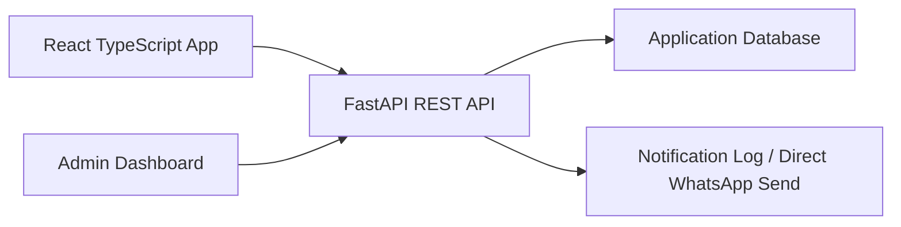

# Carthi System Architecture

## High-Level Architecture

## Backend

- FastAPI exposes REST APIs under `/api/v1`
- SQLAlchemy models keep persistence explicit and migration friendly
- SQLite is the default local database for the MVP
- Alembic is available for schema migrations
- WhatsApp messages are logged in the database, with optional direct Twilio sending when configured

## Frontend

- React.js with TypeScript
- Tailwind CSS for a clean mobile-first interface
- TanStack Query for server data
- Zustand for session state
- React Router for screen routing

## Data Consistency

Booking seat allocation must run in a transaction:

1. Load the target ride by ID.
2. Check ride status and available seats.
3. Create booking with pending or confirmed status.
4. Reduce available seats only after valid booking creation.
5. Commit the booking and notification log together.

The database transaction remains the source of truth for seat counts.

## Indexing Strategy

Recommended indexes:

- `rides(source_city, destination_city, journey_date, status)`
- `rides(route_key, journey_date, available_seats)`
- `bookings(passenger_id, status)`
- `bookings(ride_id, status)`
- `aadhaar_verifications(user_id, status)`
- `reviews(reviewee_id)`

## Local Development Plan

- Run the backend with Uvicorn
- Run the frontend with Vite
- Use SQLite for local data by default
- Use `.env` for local-only secrets and API settings
- Verify changes with backend compile checks and frontend builds

## Security Plan

- Hash passwords with bcrypt
- Sign JWTs with a strong secret
- Never store Aadhaar in plain text
- Encrypt/tokenize Aadhaar
- Mask Aadhaar and phone numbers in API responses where appropriate
- Require verified status before restricted ride actions
- Add audit logs for admin verification and blocking actions
- Rate limit auth, verification, booking, and report endpoints before production
- Add fraud checks for repeated cancellations, duplicate Aadhaar tokens, unusual booking bursts, and low-rating clusters
