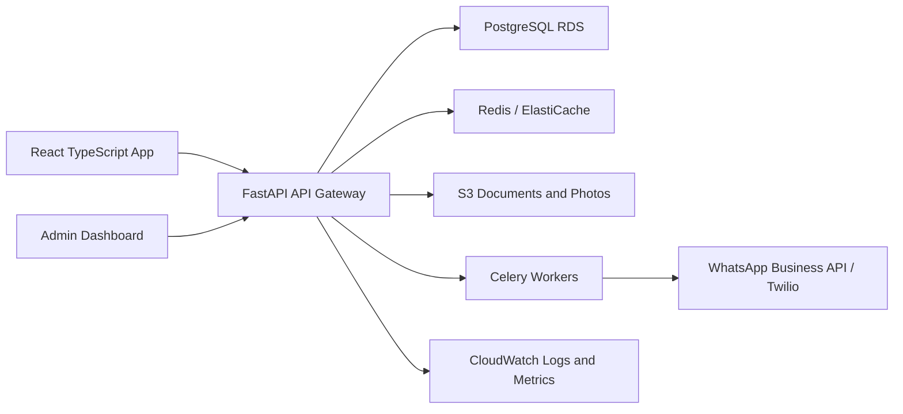

# RideSaathi System Architecture

## High-Level Architecture

## Backend

- FastAPI exposes REST APIs under `/api/v1`
- SQLAlchemy models keep persistence explicit and migration friendly
- PostgreSQL is the production database
- Redis is used for popular route cache and booking locks
- Celery handles WhatsApp, email, SMS, and later payment reconciliation jobs
- Alembic should manage schema migrations

## Frontend

- React.js with TypeScript
- Tailwind CSS for a clean mobile-first interface
- TanStack Query for server data
- Zustand for session state
- React Router for screen routing

## Data Consistency

Booking seat allocation must run in a transaction:

1. Lock ride row by ID.
2. Check ride status and available seats.
3. Create booking with pending or confirmed status.
4. Reduce available seats only after valid booking creation.
5. Commit and enqueue notification.

In PostgreSQL this should use `SELECT ... FOR UPDATE`. Redis locks can reduce duplicate submit pressure but database transactions remain the source of truth.

## Indexing Strategy

Recommended indexes:

- `rides(source_city, destination_city, journey_date, status)`
- `rides(route_key, journey_date, available_seats)`
- `bookings(passenger_id, status)`
- `bookings(ride_id, status)`
- `aadhaar_verifications(user_id, status)`
- `reviews(reviewee_id)`

## Scalability Plan

- API horizontally scales behind an ALB
- PostgreSQL uses read replicas for analytics/search-heavy admin reads
- Redis caches popular route search responses with short TTL
- Celery workers scale independently for notification bursts
- S3 + CloudFront serve vehicle and document assets
- Observability includes request logs, booking error alerts, queue lag, failed notification alerts, and suspicious cancellation spikes

## Deployment Plan

Development:

- Docker Compose with PostgreSQL, Redis, backend, frontend

Production:

- AWS ECS Fargate or Kubernetes
- AWS RDS PostgreSQL
- AWS ElastiCache Redis
- AWS S3 for uploads
- AWS CloudFront for static assets
- AWS Secrets Manager for JWT, DB, Aadhaar encryption, WhatsApp credentials
- CloudWatch for logs, metrics, alerts
- GitHub Actions for CI/CD

## Security Plan

- Hash passwords with bcrypt
- Sign JWTs with a rotating secret
- Never store Aadhaar in plain text
- Encrypt/tokenize Aadhaar using KMS-backed keys in production
- Mask Aadhaar and phone numbers in API responses where appropriate
- Require verified status before ride creation or booking
- Use signed URLs for document/photo uploads
- Add audit logs for admin verification and blocking actions
- Rate limit auth, verification, booking, and report endpoints
- Add fraud checks for repeated cancellations, duplicate Aadhaar tokens, unusual booking bursts, and low-rating clusters
